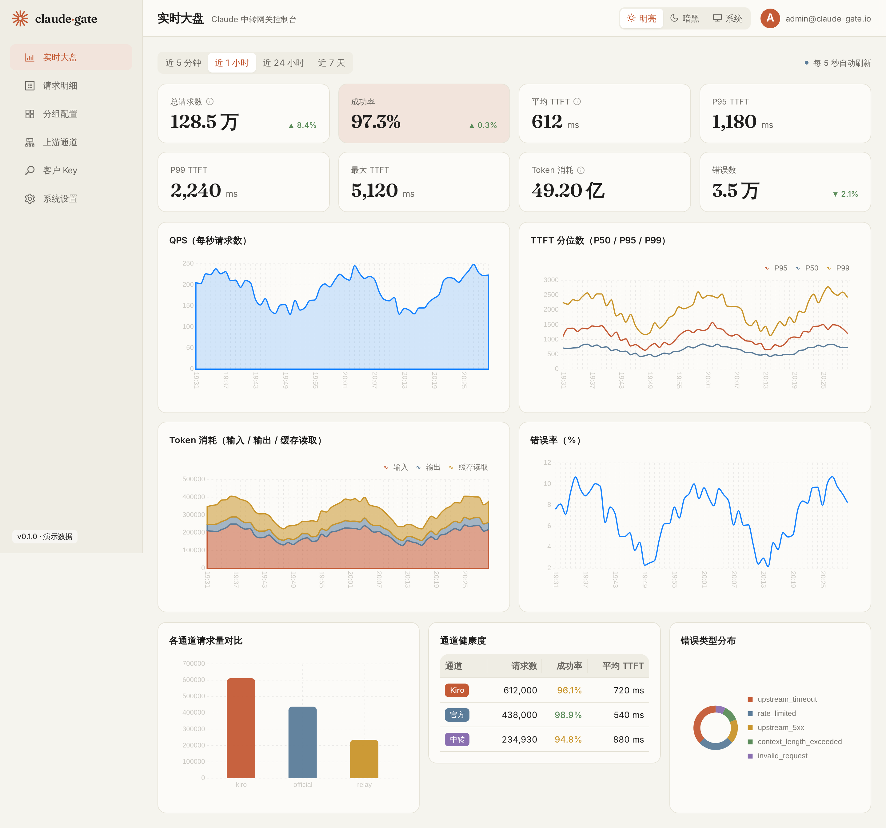
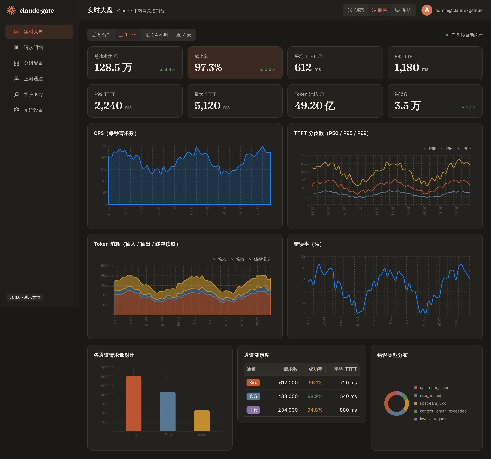
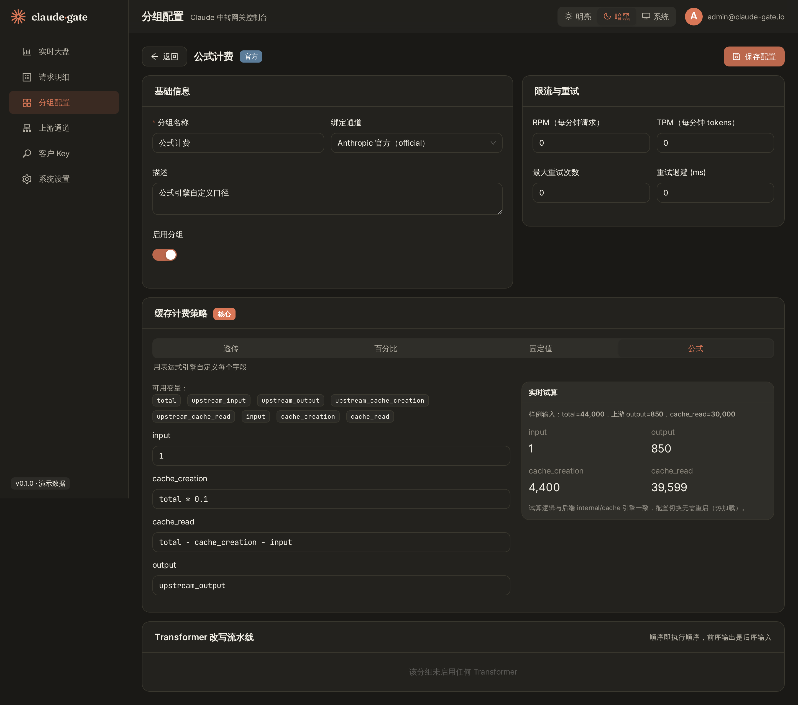
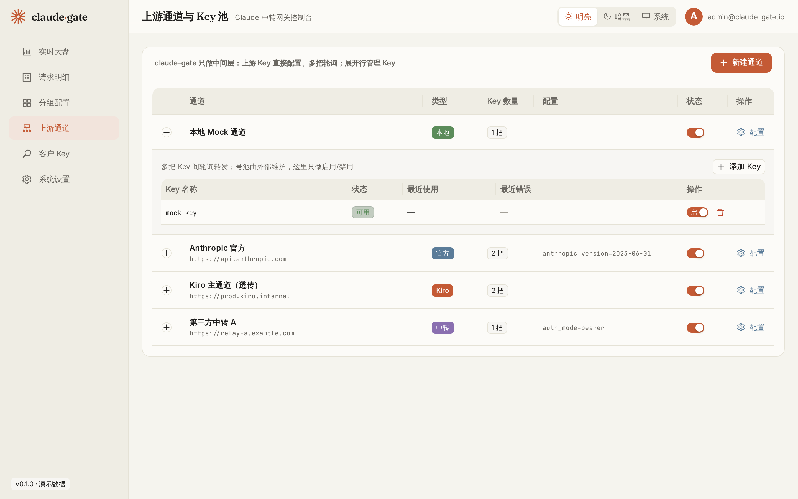

<div align="center">

# claude-gate

**面向 Claude 系列模型的可编程中转网关**

统一接入 Kiro / 官方 / Bedrock / Vertex / 第三方中转等异构上游，对客户暴露同一套 Anthropic Messages 协议。

</div>

---

## 项目简介

`claude-gate` 把"通道（channel）"抽象为可插拔的 **Adapter**，解决四个核心痛点：

1. **多通道统一接入与隔离** —— 异构上游统一成同一套对外协议，按分组隔离与路由
2. **通道差异化适配** —— Kiro 等私有通道与官方 / 云厂商通道走不同认证与协议，由 Adapter 层屏蔽
3. **可定制的缓存计费** —— 按分组配置 `cache_creation` / `cache_read` / `input` 的计算方式（透传 / 百分比 / 固定值 / 公式）
4. **错误请求的可观测与可复现** —— 任何失败请求 100% 还原 + 一键重放

> 本仓库是按《claude-gate 开发任务书 v1.0》推进的实现。当前完成度见下方 **实现状态**。

## 界面预览

控制台采用 **Claude 官网风格**（暖米色 / 赤陶色 + 衬线标题），支持**明亮 / 暗黑 / 跟随系统**三态自适应。

| 实时大盘（明亮） | 实时大盘（暗黑） |
|:---:|:---:|
|  |  |

| 缓存策略编辑器（公式 + 实时试算） | 上游通道与 Key 池 |
|:---:|:---:|
|  |  |

更多页面截图见 [`docs/screenshots/`](docs/screenshots/)（登录、请求明细、请求详情、分组、客户 Key、系统设置，均含明暗两套）。

## 技术栈

**后端**：Go 1.22 · 原生 net/http（代理路径）· `expr-lang/expr`（公式引擎）· `log/slog`（结构化日志）· PostgreSQL / ClickHouse / Redis / S3(MinIO)

**前端**：Vite + React 18 + TypeScript · **Ant Design 5**（深度定制 Claude 主题）· `@ant-design/charts` · React Router 6 · TanStack Query · Zustand

## 快速开始

### 前端控制台（演示模式，无需后端）

控制台内置 mock 数据，可独立运行与截图：

```bash
cd web
pnpm install
pnpm dev          # 开发模式 http://localhost:5173
# 或
pnpm build && pnpm preview   # 生产构建预览 http://localhost:4173
```

任意账号密码即可登录。生成全部页面明暗截图：

```bash
cd web && pnpm preview &
PLAYWRIGHT_BROWSERS_PATH=/opt/pw-browsers node scripts/screenshots.mjs
```

### 后端网关

```bash
make build        # 编译 bin/gateway 与 bin/migrate
make test         # 运行全部单元测试
make run          # 启动网关，默认 :8791
curl localhost:8791/healthz
```

### 全套依赖（docker-compose）

```bash
cd deploy && docker compose up -d   # PG / ClickHouse / Redis / MinIO + 网关 + 前端
```

## 项目结构

```
claude-gate/
├── cmd/                  网关入口 / 迁移工具
├── internal/
│   ├── domain/           领域模型与统一错误
│   ├── cache/            ⭐ 缓存计费策略引擎（四种策略 + 公式引擎）
│   ├── transformer/      请求改写流水线（model_mapper 等）
│   ├── auth/             API Key 解析 + 分组解析
│   ├── upstream/         上游适配层（official / kiro / keypool / registry）
│   ├── gateway/          HTTP 入口与代理逻辑
│   ├── observ/           trace_id 贯穿 / 明细落库 / body 落盘接口
│   ├── store/            PG / ClickHouse / Redis / S3 存储接口
│   └── config/           配置加载（yaml + env）
├── migrations/           PostgreSQL 与 ClickHouse 建表脚本
├── web/                  Vite + React + antd 控制台
├── deploy/               docker-compose / Dockerfile / nginx
└── docs/                 文档与截图
```

## 实现状态

按任务书里程碑划分，**诚实标注**当前完成度：

| 模块 | 状态 | 说明 |
|------|------|------|
| 缓存计费策略引擎（§5.3 ⭐） | ✅ 完成 | 四种策略 + 公式引擎，单测覆盖率 **96.7%** |
| Transformer 流水线（§5.4） | ✅ 完成 | 流水线 + 四个改写器 + 单测 |
| API Key 解析 / 分组解析（§5.2） | ✅ 完成 | 区分四类失败原因 + 单测 |
| 上游 Key 池调度（§5.5） | ✅ 完成 | 轮询 + cooldown + 自动恢复 + 单测 |
| 网关 HTTP 入口（§5.1） | ✅ 骨架 | 健康/就绪检查、trace_id 贯穿、结构化错误 |
| OfficialAdapter（§5.5） | ✅ 实现 | 标准 Messages 协议 + SSE 解析 |
| 前端控制台（§7，9 个页面） | ✅ 完成 | Claude 风格 + 明暗自适应 + mock 数据可独立运行 |
| 数据库迁移（§4） | ✅ 完成 | PG + ClickHouse 建表脚本 |
| **KiroAdapter（§5.5 ⭐）** | 🚧 骨架 | **私有协议待项目方提供 wire format，按任务书 §10 不臆测** |
| 存储实现（PG/CH/Redis/S3 落地） | 🚧 接口就绪 | 接口与桩已定义，待接入真实驱动 |
| Bedrock / Vertex / Relay（M5） | 🚧 占位 | 接口与目录就绪，待用官方 SDK 实现 |
| 管理 API CRUD（§6） | 🚧 占位 | 前端已用 mock 跑通，后端 handler 待接入存储 |

> ⚠️ **关于 Kiro**：任务书 §10 明确要求"Kiro 私有协议细节由项目方提供，遇到格式问题先问、不要臆测 wire format"。因此 `KiroAdapter` 只给出结构骨架与各处理环节的清晰占位（认证/令牌刷新、请求转换、流式重封装、usage 提取），待项目方提供真实协议后补全。

## 测试

```bash
go test ./... -cover
```

核心逻辑（cache / transformer / auth / keypool）均有单元测试，缓存引擎覆盖率 96.7%（任务书要求 >90%）。

## 文档

- [配置说明](docs/configuration.md) —— 全部可调参数与性能调优基线
- [通道接入指南](docs/channels.md) —— 各通道差异矩阵与接入要点

## 许可

内部项目，未开源授权。
